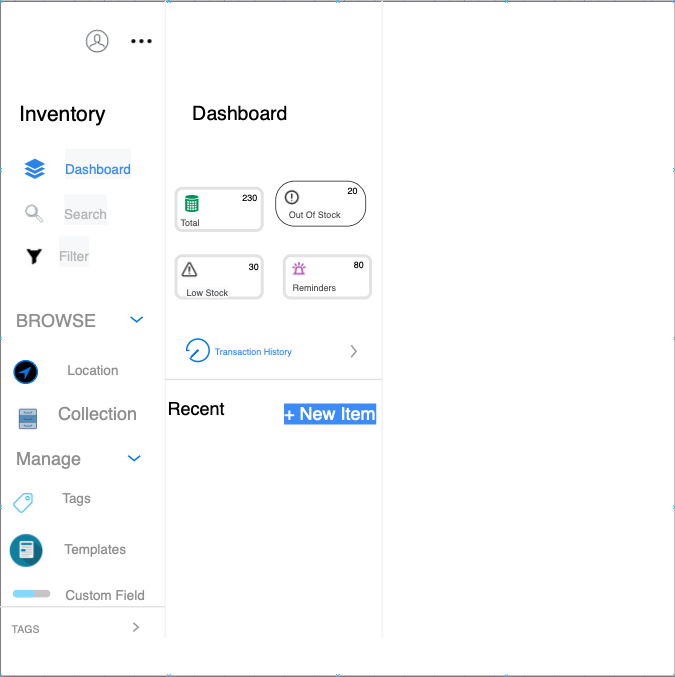

# inventory-app

A full-stack application to track your inventory

## Feature Roadmap

What our app will be adding:

- Dashboard Homepage
  

  - Out of Stock Items
    
  - Reminders
    
  - Low Stock Items
    
  - Transaction History

- Each section in the dashboard will also lead to its own page.

- Search Feature
- Filter by Category Feature

- Shopping Functionality
  - User will be able to add items to cart and checkout

## Getting Started

1. `npm install`
2. `npm run seed`
3. `npm run server-dev`
4. In a seperate terminal, `npm run client-dev`

## Product Description

### Mens Clothing

For men looking for clothes that provide comfort in different conditions like hiking, camping, mountain/rock climbing. It's also perfect for different seasons.

### Women's Clothing

Our clothing selection provides clothing items that serve multifunctional purpose. For anyone looking for quality clothing that is also comfortable look no further!

### Electronics

Our Company designs, manufactures and markets electronics like, Hard Drives, Computer Monitors and Memory cards.

### Jewelry

Our jewelry is inspired by love and love comes in many shapes in forms. Whenever you'd like to get a special gift for your partner or special friend we got you!

## Mock Ups

## Collaborating Authors

-Azebhaile
-Patrickb001
-riadh796
-WilliamVanterpool

## Deployment
